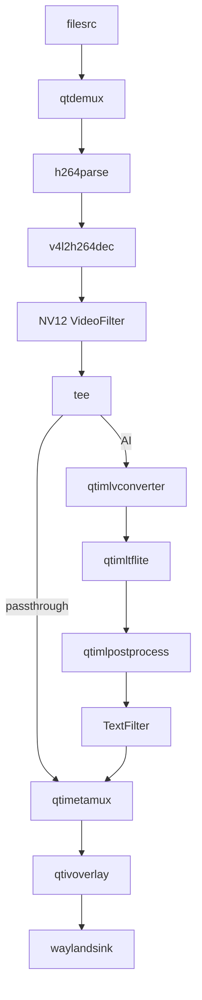

# Artifact Output Contract

This skill generates runnable C++ app artifacts in workspace.

## Folder Naming

- Folder name must start with `qimsdk-cpp-`.
- Use user-provided app name when available; if it does not include prefix, prepend `qimsdk-cpp-`.
- Else derive concise kebab-case name from request intent and prepend `qimsdk-cpp-`.

Examples:

- `qimsdk-cpp-camera-yolo-app`
- `qimsdk-cpp-appsrc-appsink-bridge`
- `qimsdk-cpp-yaml-config-demo`

## App/Binary Naming

- Generated app name should use `qimsdk-cpp-<appname>` prefix by default.
- Use this for CMake `TEST_TARGET` unless user explicitly asks for a different target name.
- Prefer keeping pipeline name aligned to the same prefix in `main.cc`.
- Folder name and app/binary name may be identical (recommended default).

## Required Files

- `main.cc`
- `CMakeLists.txt`
- `README.md`

For YAML config constructor mode using `qti::Pipeline(name, yaml_text)`, also generate the YAML config file unless the user explicitly says the YAML is already provided externally and should not be generated. Use the requested YAML basename when one is supplied, for example:

- `configs/yolov8_camera_overlay.yaml`

## README Sync Rule

- If generated code/build files are modified (`main.cc`, `main.cpp`, `*.cc`, `*.cpp`, or `CMakeLists.txt`), update `README.md` in the same artifact folder in the same pass.
- Keep `README.md` synchronized with latest code, pipeline flow, placeholders, and compile/run steps.

Optional only when needed:

- extra `.cc/.h` helper files if user requested multi-file design

## README Requirements

- Purpose and scenario
- Generated YAML config file, when YAML config constructor mode is used and the YAML is not external
- `Pipeline Flow` section derived from generated code, with `Text Summary` and `Mermaid Diagram` subsections
- User-edit placeholders (model, labels, media paths, runtime flags)
- `Steps to Compile`: exactly the line `Yocto: https://imsdkdocs.qualcomm.com/advanced/yocto-build#steps-to-build-custom-application` — no build/CMake commands, no other text
- `Steps to Run on QLI`: first confirm all models, labels, media, and other referenced files are present on the device, then `scp` the compiled binary to the device, `ssh` in, `chmod +x` it, and run it
- Assumptions and limitations
- Custom preprocess TODOs, when generated
- Custom postprocess TODOs, when generated

If a `qticamsrc`/`qtiqmmfsrc` camera app defaults omitted camera caps to `1920x1080 @ 30fps`, README assumptions must call out that default explicitly.

## Runtime Setup for Steps to Run on QLI

Before writing README `Steps to Run on QLI`, inspect the actual generated `main.cc` and determine which of these apply:

- If one or more stages explicitly selects the GPU delegate (`.set("delegate", "gpu")` on a discrete filter/inference stage, or `.set("inference-delegate", "gpu")` on an ML-bin stage — not for HTP/NPU external delegate selections), include `export OCL_ICD_FILENAMES=/usr/lib/libOpenCL_adreno.so.1`.
- If the app has a high-scale/concurrency topology (multiple independent, concurrently active input streams — multistream fan-out, an AI wall of separate source streams, or genuine multi-stream batched inference across multiple sources; not a single input stream even with multiple parallel AI branches, a daisy-chain, or a display grid), include `ulimit -n 10000`.
- If one or more sinks is `waylandsink` (including multiple instances), include Wayland socket discovery (`WS=$(find ...)`, `XDG_RUNTIME_DIR`, `WAYLAND_DISPLAY`).
- If `main.cc` contains `pulsesrc` or `pulsesink`, include `wpctl status` followed by `wpctl set-default <node_no.>`. Replace `<node_no.>` with the actual device-specific node number discovered from `wpctl status`; no default node number can be assumed.
- If `main.cc` uses `qticamsrc`/`qtiqmmfsrc`/`v4l2src` (camera), consumes an RTSP input, or reads from `filesrc`/another file-backed source, add a short prose note (not a shell export) immediately after the run command stating the corresponding readiness requirement: camera/`cam-server` availability, an upstream RTSP producer already running, or the input file(s) existing at their referenced paths.

Join every applicable command from the four rows above into exactly ONE combined `&&`-chained bash block, run ON THE DEVICE after `ssh` and immediately before the `chmod`/binary run command — never on the host before `scp` — in this order: PulseAudio node selection, GPU/OpenCL export, file-descriptor limit, then Wayland discovery/exports:

```bash
wpctl status && \
wpctl set-default <node_no.> && \
export OCL_ICD_FILENAMES=/usr/lib/libOpenCL_adreno.so.1 && \
ulimit -n 10000 && \
WS=$(find /run -maxdepth 3 -name "wayland-*" ! -name "*.lock" 2>/dev/null | head -1) && \
export XDG_RUNTIME_DIR=$(dirname "$WS") && \
export WAYLAND_DISPLAY=$(basename "$WS")
```

Omit each line whose row is not applicable and omit the whole block if no command-based row applies. The `&&` chain must remain one fenced bash block even when only one command-based prerequisite applies.

## YAML Artifact Rules

When the app constructs a pipeline with YAML text, for example `qti::Pipeline pipeline("name", config);`:

- Generate the YAML config file in the artifact unless the user explicitly says an external YAML is already supplied and should not be generated.
- If the user explicitly says the YAML file already exists or is provided externally, do not generate it; put the exact phrase `External YAML provided by user` in README assumptions.
- Preserve the user-provided YAML target path in code or command-line examples when supplied.
- If the generated YAML is stored under the artifact, include `Steps to Run on QLI` commands that create the target directory and copy the YAML to the target path before the `./<binary-name>` run command.
- If model, label, media, or settings paths are missing, put explicit placeholders in the YAML and list them in README.
- The YAML root must be `pipeline:`, with `elements:` and `links:` sections matching the SDK parser.
- Every `pipeline.elements` item must use `type:` and `name:`. For normal GStreamer elements, `type:` is the factory name, for example `type: qticamsrc`; do not emit a separate `factory:` key.
- Element properties must be flat keys on the element mapping, for example `camera: 0` or `model: /path/model.tflite`; do not nest them under `properties:`.
- Encode stream filters as `type: filter` with `video:`, `text:`, `tensor:`, `image:`, `h264:`, `audio:`, or `caps:` blocks.

## Pipeline Flow Rules

- Include `## Pipeline Flow` with a concise text summary of actual element order and branch paths from code.
- Include `### Text Summary` immediately before the text summary.
- Include `### Mermaid Diagram` immediately before a fenced Mermaid diagram using a `mermaid` code fence.
- Include `## Steps to Compile` immediately before `## Steps to Run on QLI`, containing exactly one line: `Yocto: https://imsdkdocs.qualcomm.com/advanced/yocto-build#steps-to-build-custom-application`. Do not add CMake commands, build directories, or any other compile instructions under this heading.
- Include `## Steps to Run on QLI` for runtime commands. As the first line, always state that all models, labels, media, and any other files the app references must already be present on the device at their referenced paths before running. Then show the scp/ssh/chmod/run sequence to get the compiled binary onto the QLI device and execute it, substituting the artifact's actual `TEST_TARGET` binary name for `<binary-name>` (never leave the literal placeholder text `<binary-name>` in the generated README) and keeping `<device-ip>` as an explicit unresolved placeholder. The applicable `&&`-chained env-setup block (omit if no command-based prerequisite row applies) runs ON THE DEVICE, after `ssh` and before `chmod`/the run command — never on the host before `scp`:
  ```bash
  # Copy the app to device
  scp <binary-name> root@<device-ip>:/root/

  # SSH into device and run
  ssh root@<device-ip>
  chmod +x /root/<binary-name>
  ./<binary-name>
  ```
  When a command-based prerequisite applies, insert the env-setup block between `ssh root@<device-ip>` and `chmod +x /root/<binary-name>`, for example:
  ```bash
  # Copy the app to device
  scp <binary-name> root@<device-ip>:/root/

  # SSH into device and run
  ssh root@<device-ip>
  export OCL_ICD_FILENAMES=/usr/lib/libOpenCL_adreno.so.1 && \
  ulimit -n 10000 && \
  WS=$(find /run -maxdepth 3 -name "wayland-*" ! -name "*.lock" 2>/dev/null | head -1) && \
  export XDG_RUNTIME_DIR=$(dirname "$WS") && \
  export WAYLAND_DISPLAY=$(basename "$WS")
  chmod +x /root/<binary-name>
  ./<binary-name>
  ```
  If `main.cc` uses a camera (`qticamsrc`/`qtiqmmfsrc`/`v4l2src`), consumes an RTSP input, or reads from `filesrc`/another file-backed source, add a short prose note (not a shell export) immediately after the run command stating the corresponding readiness requirement: camera/`cam-server` availability, an upstream RTSP producer already running, or the input file(s) existing at their referenced paths.
- For multi-branch graphs, provide one line per branch.
- For dual-pipeline apps, provide clearly named `Pipeline 1 Flow` and `Pipeline 2 Flow` subsections.
- Do not describe stages not present in code.
- Use `flowchart LR` for simple linear pipelines.
- Use `flowchart TD` for branched, daisy-chain, multi-stream, or dual-pipeline apps.
- Use unique node IDs and node labels that match SDK element/plugin names present in `main.cc`.
- Represent stream filters as explicit nodes, such as `[NV12 VideoFilter]` or `[TextFilter]`.
- Use `subgraph` for AI stages, daisy-chain stages, multiple streams, or multiple independent pipelines.
- Label tee or split edges only when it improves clarity, for example `-->|AI|` or `-->|passthrough|`.

Example:



## Final Response Rules

- Report created file paths.
- Provide short build and run commands.
- Avoid dumping full large files unless user asks.

## Verification Workflow

After generating or editing an artifact:

```bash
references/verify-cpp-app.sh <artifact-dir>
```

Then review contextually:

- Does the topology match the request?
- Are placeholders listed in README?
- Does README `Text Summary` and `Mermaid Diagram` match code?
- Is construction style explicit unless user requested fluent/implicit style?
- Are custom preprocess placeholders honest about missing tensor conversion logic?
- Are custom postprocess placeholders type-compatible with SDK callback typedefs?

## CMake Baseline

Use this baseline unless user asks otherwise:

```cmake
set(TEST_TARGET qimsdk-cpp-<appname>)

add_executable(${TEST_TARGET}
  main.cc
)

target_link_libraries(${TEST_TARGET} PRIVATE
  qimsdk-app-builder
)

install(
  TARGETS ${TEST_TARGET}
  RUNTIME DESTINATION ${QIMSDK_BINDIR}
  PERMISSIONS OWNER_EXECUTE OWNER_WRITE OWNER_READ
              GROUP_EXECUTE GROUP_READ
              WORLD_EXECUTE WORLD_READ
)
```

Avoid mandatory `find_package(PkgConfig REQUIRED)` and `pkg_check_modules(...)` in default outputs.

## CMake Sanity Checks

- Keep `main.cc` listed in `add_executable(${TEST_TARGET} ...)`.
- Keep `qimsdk-app-builder` in `target_link_libraries(${TEST_TARGET} PRIVATE ...)`.
- Ensure `${QIMSDK_BINDIR}` is defined by the parent build; if not, document it in `README.md` as a build prerequisite.
- Keep install permissions exactly as shown in the template unless user requests a different install policy.

## Standalone App Build (outside SDK tree)

Use the following template when building outside the SDK's own tree against an installed SDK (e.g. when `${QIMSDK_BINDIR}` is not set by a parent build system, or when the user asks for a self-contained standalone CMakeLists.txt). The SDK's own examples link a single target, `qimsdk-app-builder`, and never link GStreamer or QTI ML/video-base libraries directly — those are private/transitive to `qimsdk-app-builder`:

```cmake
cmake_minimum_required(VERSION 3.8.2)
project(my_qimsdk_app LANGUAGES CXX)

set(CMAKE_CXX_STANDARD 17)
set(CMAKE_CXX_STANDARD_REQUIRED ON)

add_executable(my_qimsdk_app main.cc)
target_link_libraries(my_qimsdk_app PRIVATE qimsdk-app-builder)
```

If `qimsdk-app-builder` is not resolvable via CMake `find_package`/pkg-config in the target build environment, add explicit include/link paths instead of guessing package names:

```cmake
target_include_directories(my_qimsdk_app PRIVATE <QIMSDK_INSTALL_PREFIX>/include)
target_link_directories(my_qimsdk_app PRIVATE <QIMSDK_INSTALL_PREFIX>/lib)
target_link_libraries(my_qimsdk_app PRIVATE qimsdk-app-builder)
```

Use `<QIMSDK_INSTALL_PREFIX>` as an explicit placeholder — do not invent a default install path. Do not add `pkg_check_modules(...)` calls for GStreamer packages — this SDK's CMake integration links a single `qimsdk-app-builder` target rather than raw GStreamer packages.
