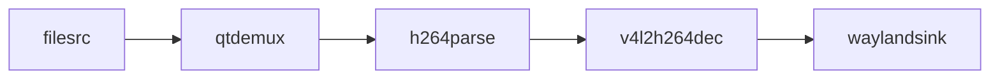
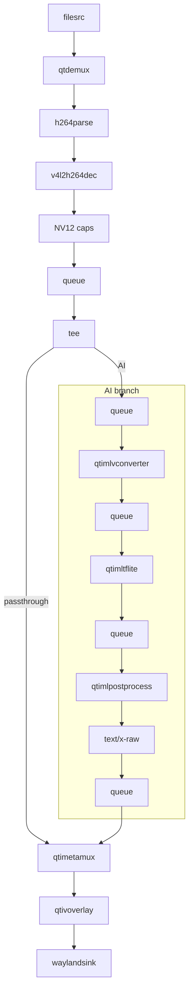
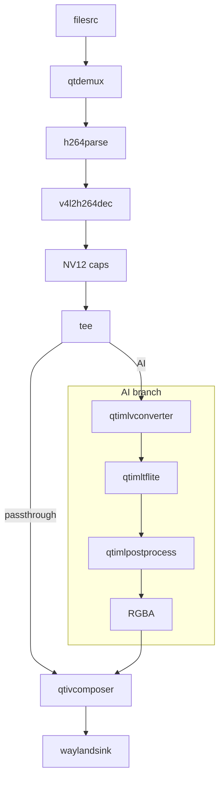
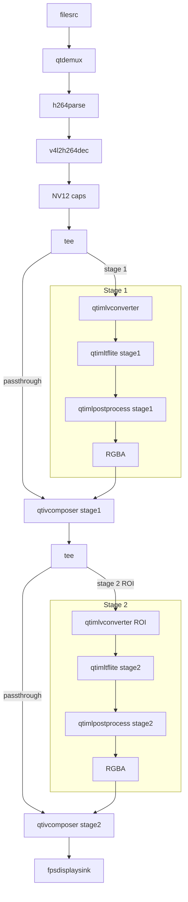
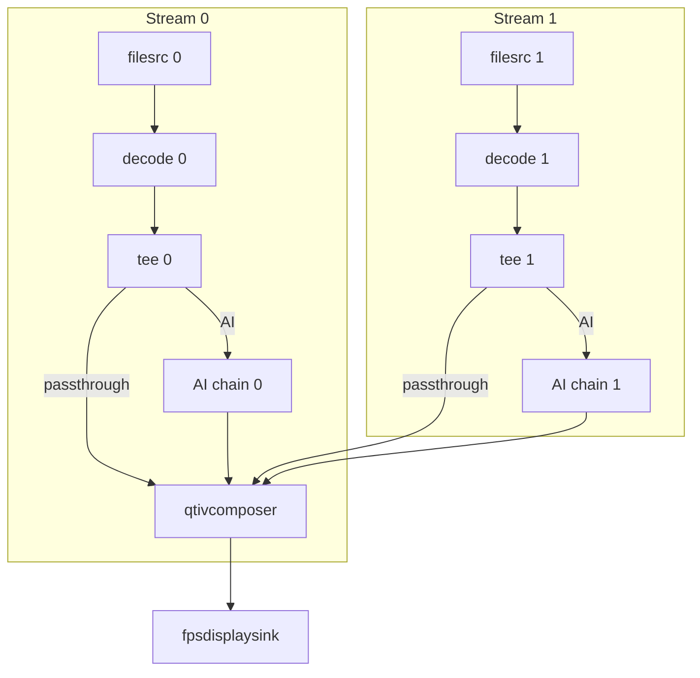

# Artifact Contract

## Purpose

Canonical generated artifact layout, README Pipeline Flow, and verification contract.

## Load When

Load whenever creating, modifying, validating, or packaging generated artifacts.

## This File Owns

- Exact file counts and filenames for command and C app artifacts
- README required sections and placeholders
- Pipeline Flow format
- Verification scripts, checklist, and failure handling

## This File Does Not Own

- Pipeline topology; use AI or multimedia pattern references
- Plugin property facts; use plugin-catalog.md
- C API details; use c-app-development.md

---


---

## Artifact Output Packaging

# Artifact Output Packaging

## Use This Reference For

- Generating file-based deliverables instead of copy-paste-only answers
- Structuring outputs for `gst-launch` pipelines and C sample apps
- Keeping generated artifacts runnable with minimal user edits

---

## Folder Naming — Always Required

- Folder name must **always** start with `qimsdk-gstreamer-`
- Use lowercase kebab-case only — no spaces, no uppercase
- Derive from the pipeline or app description if user did not provide a name
- If user provided a name without the prefix, prepend `qimsdk-gstreamer-`

**Examples:**
- `qimsdk-gstreamer-single-stream-object-detection`
- `qimsdk-gstreamer-two-stream-side-by-side`
- `qimsdk-gstreamer-daisychain-detection-classification`
- `qimsdk-gstreamer-audio-classification`

---

## Required Files by Request Type

### gst-launch Command Request — exactly these 2 files, no more, no less:

| File | Required | Notes |
|------|----------|-------|
| `pipeline.sh` | ✅ Always | Shebang + complete runnable gst-launch-1.0 command |
| `README.md` | ✅ Always | See README contract below |

`pipeline.sh` must:
- Start with `#!/usr/bin/env bash` on line 1
- Contain one complete runnable `gst-launch-1.0` command
- Use explicit placeholders (`<INPUT_FILE>`, `<MODEL_PATH>`, etc.) for unknown values

### C Sample App Request — exactly these 3 files, no more, no less:

| File | Required | Notes |
|------|----------|-------|
| `main.c` | ✅ Always | Complete compilable C source |
| `CMakeLists.txt` | ✅ Always | Use template from `c-app-development.md` |
| `README.md` | ✅ Always | See README contract below |

---

## README Sync Rule


- If generated code changes (`pipeline.sh` or `main.c`), update `README.md` in the same artifact folder in the same pass.
- Keep `README.md` synchronized with latest command/code, `Pipeline Flow`, placeholders, and run/build steps.

---

## README.md Contract — gst-launch

`README.md` must include all of these sections in this order:

1. **Purpose** — one or two sentences describing what the pipeline does
2. **Files** — table listing each file and its purpose
3. **Pipeline Flow** — Text Summary + Mermaid Diagram (per `artifact-contract.md`)
4. **Placeholders to Fill** — list every `<PLACEHOLDER>` in `pipeline.sh` with a description
5. **Steps to Run on QLI**:
   - First line, always: state that all models, labels, media, and any other files the pipeline references must already be present on the device at their referenced paths before running.
   - If the pipeline contains `pulsesrc` or `pulsesink`, include `wpctl status` followed by `wpctl set-default <node_no.>` on the device, after `ssh` and before the run command. Replace `<node_no.>` with the actual device-specific node number discovered from `wpctl status`; no default node can be assumed.
   - If one or more elements explicitly selects the GPU delegate (bare `delegate=gpu` on a discrete `qtimltflite`/`qtimlsnpe`/`qtimlqnn` element, or `inference-delegate=gpu` on an ML-bin stage — not for HTP/NPU external delegate selections), include `export OCL_ICD_FILENAMES=/usr/lib/libOpenCL_adreno.so.1` on the device, after `ssh` and before the run command.
   - If the pipeline has a high-scale/concurrency topology (multiple independent, concurrently active input streams — multistream fan-out, an AI wall of separate source streams, or genuine multi-stream batched inference across multiple sources; not a single input stream even with multiple parallel AI branches, a daisy-chain, or a display grid), include `ulimit -n 10000` on the device, after `ssh` and before the run command.
   - If one or more sinks is `waylandsink` (including multiple instances), include Wayland socket discovery on the device, after `ssh` and before the run command:
     ```bash
     WS=$(find /run -maxdepth 3 -name "wayland-*" ! -name "*.lock" 2>/dev/null | head -1) && \
     export XDG_RUNTIME_DIR=$(dirname "$WS") && \
     export WAYLAND_DISPLAY=$(basename "$WS")
     ```
   - Join every applicable command from the four rows above into exactly ONE combined `&&`-chained bash block, in this order: PulseAudio node selection, GPU/OpenCL export, file-descriptor limit, then Wayland discovery/exports. Omit each line whose row is not applicable and omit the whole block if none apply. The `&&` chain must remain one fenced bash block even when only one row applies.
   - Emit the scp/ssh/(env-block)/run sequence to get the artifact onto the QLI device and execute it, with the env-setup block (if any) inserted on the device, between `ssh` and the run command — never on the host before `scp`:
     ```bash
     # Copy the app to device
     scp pipeline.sh root@<device-ip>:/root/

     # SSH into device and run
     ssh root@<device-ip>
     chmod +x /root/pipeline.sh
     bash /root/pipeline.sh
     ```
     When a command-based prerequisite applies, insert the env-setup block between `ssh root@<device-ip>` and `chmod +x /root/pipeline.sh`, for example:
     ```bash
     # Copy the app to device
     scp pipeline.sh root@<device-ip>:/root/

     # SSH into device and run
     ssh root@<device-ip>
     WS=$(find /run -maxdepth 3 -name "wayland-*" ! -name "*.lock" 2>/dev/null | head -1) && \
     export XDG_RUNTIME_DIR=$(dirname "$WS") && \
     export WAYLAND_DISPLAY=$(basename "$WS")
     chmod +x /root/pipeline.sh
     bash /root/pipeline.sh
     ```
     Keep `<device-ip>` as an explicit placeholder — never invent a real IP.
   - If the pipeline uses a camera (`qticamsrc`/`qtiqmmfsrc`/`v4l2src`), consumes an RTSP input, or reads from `filesrc`/another file-backed source, add a short prose note (not a shell export) immediately after the run command stating the corresponding readiness requirement: camera/`cam-server` availability, an upstream RTSP producer already running, or the input file(s) existing at their referenced paths.
6. **Assumptions** — codec, display server, model format, delegate library location. If the pipeline targets "maximum resolution", state that 3840×2160 (4K UHD) was assumed as the maximum and the user should adjust if their display or source differs. If a `qticamsrc`/`qtiqmmfsrc` camera pipeline defaults omitted camera caps to `1920x1080 @ 30fps`, state that here. If `qtimlpostprocess module=` is not in `plugin-catalog.md`'s Supported Module Table and `tensors=`/`layers=` was omitted, state that here: the module is undocumented in this skill and tensor filtering was omitted unverified.

---

## README.md Contract — C Sample App

`README.md` must include all of these sections in this order:

1. **Purpose** — one or two sentences describing what the app does
2. **Files** — table listing each file and its purpose
3. **Pipeline Flow** — Text Summary + Mermaid Diagram (per `artifact-contract.md`)
4. **Placeholders to Fill** — list every `<PLACEHOLDER>` in `main.c` and `CMakeLists.txt` with a description
5. **Steps to Run on QLI**:
   - First line, always: state that all models, labels, media, and any other files the app references must already be present on the device at their referenced paths before running.
   - If the app uses `pulsesrc` or `pulsesink`, include `wpctl status` followed by `wpctl set-default <node_no.>` on the device, after `ssh` and before the run command. Replace `<node_no.>` with the actual device-specific node number discovered from `wpctl status`; no default node can be assumed.
   - If one or more elements explicitly selects the GPU delegate (bare `delegate=gpu` on a discrete `qtimltflite`/`qtimlsnpe`/`qtimlqnn` element, or `inference-delegate=gpu` on an ML-bin stage — not for HTP/NPU external delegate selections), include `export OCL_ICD_FILENAMES=/usr/lib/libOpenCL_adreno.so.1` on the device, after `ssh` and before the run command.
   - If the app has a high-scale/concurrency topology (multiple independent, concurrently active input streams — multistream fan-out, an AI wall of separate source streams, or genuine multi-stream batched inference across multiple sources; not a single input stream even with multiple parallel AI branches, a daisy-chain, or a display grid), include `ulimit -n 10000` on the device, after `ssh` and before the run command.
   - If one or more sinks is `waylandsink` (including multiple instances), include Wayland socket discovery on the device, after `ssh` and before the run command:
     ```bash
     WS=$(find /run -maxdepth 3 -name "wayland-*" ! -name "*.lock" 2>/dev/null | head -1) && \
     export XDG_RUNTIME_DIR=$(dirname "$WS") && \
     export WAYLAND_DISPLAY=$(basename "$WS")
     ```
   - Join every applicable command from the four rows above into exactly ONE combined `&&`-chained bash block, in this order: PulseAudio node selection, GPU/OpenCL export, file-descriptor limit, then Wayland discovery/exports. Omit each line whose row is not applicable and omit the whole block if none apply. The `&&` chain must remain one fenced bash block even when only one row applies.
   - Emit the scp/ssh/(env-block)/run sequence, using the artifact's actual `GST_EXAMPLE_BIN` binary name (e.g. `gst-qimsdk-event-encoder`) in place of the file/run placeholders below — never a generic placeholder like `<binary-name>` — with the env-setup block (if any) inserted on the device, between `ssh` and the run command — never on the host before `scp`:
     ```bash
     # Copy the app to device
     scp <binary-name> root@<device-ip>:/root/

     # SSH into device and run
     ssh root@<device-ip>
     chmod +x /root/<binary-name>
     ./<binary-name> [required arguments]
     ```
     When a command-based prerequisite applies, insert the env-setup block between `ssh root@<device-ip>` and `chmod +x /root/<binary-name>`, for example:
     ```bash
     # Copy the app to device
     scp <binary-name> root@<device-ip>:/root/

     # SSH into device and run
     ssh root@<device-ip>
     WS=$(find /run -maxdepth 3 -name "wayland-*" ! -name "*.lock" 2>/dev/null | head -1) && \
     export XDG_RUNTIME_DIR=$(dirname "$WS") && \
     export WAYLAND_DISPLAY=$(basename "$WS")
     chmod +x /root/<binary-name>
     ./<binary-name> [required arguments]
     ```
     Substitute the real binary name for `<binary-name>` and keep `<device-ip>` as an explicit placeholder — never invent a real IP.
   - If the app uses a camera (`qticamsrc`/`qtiqmmfsrc`/`v4l2src`), consumes an RTSP input, or reads from `filesrc`/another file-backed source, add a short prose note (not a shell export) immediately after the run command stating the corresponding readiness requirement: camera/`cam-server` availability, an upstream RTSP producer already running, or the input file(s) existing at their referenced paths.
6. **Assumptions** — codec, display server, model format, delegate library location. If the pipeline targets "maximum resolution", state that 3840×2160 (4K UHD) was assumed as the maximum and the user should adjust if their display or source differs. If a `qticamsrc`/`qtiqmmfsrc` camera pipeline defaults omitted camera caps to `1920x1080 @ 30fps`, state that here. If `qtimlpostprocess module=` is not in `plugin-catalog.md`'s Supported Module Table and `tensors=`/`layers=` was omitted, state that here: the module is undocumented in this skill and tensor filtering was omitted unverified.
7. **Build Instructions** — always last, no exceptions:

```markdown
## Build Instructions

- **QLI:** https://imsdkdocs.qualcomm.com/advanced/yocto-build#steps-to-build-custom-application
```

---

## Placeholder Policy

- Never invent unknown absolute paths or model-specific module values
- Use explicit placeholders: `<MODEL_PATH>`, `<LABELS_PATH>`, `<INPUT_FILE>`, `<OUTPUT_FILE>`, `<RTSP_URL>`
- Every placeholder in generated source files must also appear in the README "Placeholders to Fill" section
- Placeholder names must be consistent between `main.c`/`pipeline.sh` and `README.md`

---

## Final Response Contract

After generating all files:
- State the folder path and list every file created
- Provide the run command (one line)
- Do not paste full file contents unless the user asks

---

## README Pipeline Flow

# Pipeline Flow Output

## Use This Reference For

- Generating consistent pipeline flow summaries for every produced artifact
- Keeping flow text aligned with actual command/code wiring
- Explaining branch behavior for tee, metadata mux, multistream, and daisy-chain layouts

## Required README Section

Every generated artifact `README.md` must include a `## Pipeline Flow` section with `### Text Summary` and `### Mermaid Diagram` subsections. The Mermaid diagram must render correctly in standard markdown viewers.

The section must be generated from the actual output command/code, not from generic templates.

## Mermaid Diagram Rules

Every `### Mermaid Diagram` subsection must include a properly fenced Mermaid diagram.

**Direction rule — choose based on complexity:**
- `flowchart LR` (left-to-right): only for simple linear pipelines with no branching (e.g. single-stream no tee)
- `flowchart TD` (top-down): for all pipelines with tee branches, multiple streams, or daisy-chains — prevents excessive horizontal width

**Formatting rules — the diagram must be valid Mermaid:**
- Node labels use `[element-name]` — use the actual factory name (e.g. `[qtimltflite]`)
- Edge labels use `-->|label|` only on tee branches to identify their purpose
- Every node ID must be unique — use short descriptive IDs (e.g. `SRC`, `DEMUX`, `TEE`, `AI`, `COMP`)
- Do not use special characters in node labels — no `!`, `/`, `<`, `>`, `:` inside brackets
- Caps constraints go in a separate node: `[NV12 caps]`, `[RGBA]`
- Use `subgraph` to group related stages and reduce visual noise in complex pipelines

## Mermaid Templates by Pipeline Type

### Simple linear (no tee) — use LR
````markdown

````

### Single-stream with AI branch (Topology A — qtimetamux + qtivoverlay) — use TD
````markdown

````

### Single-stream with AI branch (Topology B — RGBA + qtivcomposer) — use TD
````markdown

````

### Daisy-chain (two-stage) — use TD with subgraphs
````markdown

````

### Multi-stream (N sources) — use TD with subgraphs per stream
````markdown

````

## Text Flow Summary Rules

In addition to the Mermaid diagram, include a concise text summary:

- Use stage order: source → decode → tee → branches → compose → output
- For daisy-chain: one line per stage (`STAGE_1`, `STAGE_2`)
- For multi-stream: one line per stream (`STREAM_0`, `STREAM_1`)
- For multiple independent pipelines: use `Pipeline 1 Flow` and `Pipeline 2 Flow` subsections.

Example:
```
### Text Summary
  filesrc → qtdemux → h264parse → v4l2h264dec → NV12 → tee
  tee [passthrough] → qtivcomposer (sink_0)
  tee [AI] → qtimlvconverter → qtimltflite → qtimlpostprocess → RGBA → qtivcomposer (sink_1)
  qtivcomposer → fpsdisplaysink
```

## Validation Checklist

- Mermaid block uses ` ```mermaid ` fence (not ` ```text `)
- Simple linear pipelines use `flowchart LR`; branched/daisy-chain/multi-stream use `flowchart TD`
- Complex pipelines use `subgraph` to group stages
- Every node ID is unique within the diagram
- No special characters inside `[node labels]`
- Every element in the diagram is present in the generated code
- Branch labels on tee edges identify their purpose

---

## Artifact Verification

# Artifact Verification

## Purpose

After generating any artifact, the skill MUST run verification before declaring the output complete. Verification has two layers:

1. **Automated script checks** — objective grep-based rules that are always wrong regardless of pipeline type. Run the appropriate script; if any check fails, fix the artifact and re-run.
2. **Contextual review** — rules that depend on pipeline shape. Work through the relevant checklist and confirm each item.

---

## Layer 1 — Run the Verification Scripts

### For C apps (`main.c` + `CMakeLists.txt`)

```bash
bash references/verify-c-app.sh <path/to/main.c> <path/to/CMakeLists.txt>
```

If any `[FAIL]` lines appear, fix the issue and re-run until all checks pass.

### For gst-launch commands (`pipeline.sh`)

```bash
bash references/verify-gst-launch.sh <path/to/pipeline.sh>
```

If any `[FAIL]` lines appear, fix the issue and re-run until all checks pass.

### What the scripts check

**C app script (`verify-c-app.sh`):**

| # | What it checks | Why it matters |
|---|---------------|----------------|
| 1 | No local `gboolean ret` scratch variable | Unused link-status variables fail under `-Werror`; link inline and fail directly to cleanup |
| 2 | Every `gst_element_factory_make()` result has a null check plus cleanup goto | Missing factory checks hide plugin creation failures and cause later crashes |
| 3 | GstAppContext not redefined | Redefinition causes `-Werror=conflicting-types` build failure |
| 4 | Full include path `<gst/sampleapps/gst_sample_apps_utils.h>` | Short form fails on Ubuntu aarch64 (doubled path segment) |
| 5 | No wrong include forms | `"gstappsutils.h"` and short `<gst_sample_apps_utils.h>` both fail |
| 6 | `appctx.mloop` used | `.loop` and `.main_loop` don't exist in `GstAppContext` — segfault |
| 7 | `gst_element_get_request_pad` not used | Deprecated, causes `-Werror=deprecated-declarations` |
| 8 | No invented plugin names | `qtivdec`, `qtimlinference`, etc. don't exist — pipeline fails at element creation |
| 9 | `qtimlvconverter mode` set via `gst_element_set_enum_property` | `g_object_set` with string for enum = garbage integer + GLib-CRITICAL at runtime |
| 10 | `qtimlvconverter image-disposition` set via `gst_element_set_enum_property` | Same reason |
| 10b | `qtimetatransform module` set via `gst_element_set_enum_property` | Same reason |
| 11 | Bus callbacks not reimplemented | Reimplementing causes linker errors or shadowing |
| 12 | `init_app_context`/`deinit_app_context` not used | These helpers are not declared by sample-app utils |
| 13 | `gst_set_default_bus_callback`/`register_bus_signals` not used | These helpers are not declared by sample-app utils; use direct bus signal connects |
| 14 | `bus_callback`/`setup_interrupt_handler` not used | Use the sample-app bus callbacks directly and install SIGINT with `g_unix_signal_add` |
| 15 | `handle_interrupt_signal` not reimplemented | Same reason |
| 16 | `get_enum_value` uses element/property/nick signature | `GST_TYPE_*` two-argument form does not compile against sample-app utils |
| 16b | `get_enum_value` does not use output pointer argument | The helper returns the enum integer directly |
| 17 | No hardcoded numeric `qtimlpostprocess` module defines | Module enum values can drift across builds; resolve by nick with `get_enum_value()` |
| 18 | No hardcoded numeric TFLite delegate defines | Use `GST_ML_TFLITE_DELEGATE_*` constants from SDK headers |
| 19 | `qtimlvconverter` enum properties are not raw integers via `g_object_set` | Use string nick helpers so generated code stays readable and SDK-version tolerant |
| 20 | `qtimlpostprocess module` is not a raw integer via `g_object_set` | Resolve the module nick with `get_enum_value(element, "module", "<nick>")` |
| 21 | `qtimetamux` does not request invented `sink_0`/`sink_1` pads | `qtimetamux` media sink is `sink`; metadata request pads use `data_%u` |
| 22 | `qtimlpostprocess` + `qtimetamux` path declares `text/x-raw` | Metadata caps must be explicit before muxing for overlay flows |
| 23 | Direct `GST_STATE_PLAYING` usage also includes `GST_STATE_PAUSED` | Sample apps should preroll through PAUSED; callback handles transition to PLAYING |
| 24 | `qtivtransform` presence flagged for review | See contextual review below |
| 25 | cmake VERSION 3.16 | Lower versions break the parent cmake tree |
| 26 | LANGUAGES C CXX | Omitting breaks QIMSDK convention |
| 27 | `gstappsutils` linked | Without it, `GstAppContext`, `get_enum_value`, etc. are undefined at link time |
| 28 | No `gstreamer-1.0/gst/sampleapps/` in include dirs | Doubles path segment, header not found |
| 29 | `install()` target present | Without it, binary won't be installed to `/usr/bin` |
| 30 | No non-standard QTI libs linked | `gstqtisampleappsutils` etc. don't exist in the build tree |

**gst-launch script (`verify-gst-launch.sh`):**

| # | What it checks | Why it matters |
|---|---------------|----------------|
| 1 | Shebang is `#!/usr/bin/env bash` | Wrong shebang can resolve to a different shell on some systems |
| 2 | No invented plugin names | Non-existent plugins cause `no element "X"` at launch |
| 3 | Composer-to-encoder path uses `qtivcomposer ! video/x-raw,format=NV12 ! v4l2h264enc` | This path avoids mmap failures seen with DMA-backed compositor output |
| 4 | Valid composer-to-encode path for file output (explicit NV12 caps or direct negotiated path) | Prevents false failures from multiline formatting and equivalent negotiated paths |
| 5 | `v4l2h264enc` has IO mode properties | Missing io-mode = no DMA encode, poor performance or failure |
| 6 | `waylandsink fullscreen=true` | Omitting causes windowed display or display failure |
| 7 | External delegate path and options present | Missing either = HTP backend not loaded, inference fails |
| 8 | Bare filename in `external-delegate-path` | Absolute path = library not found on device |

---

## Layer 2 — Contextual Review Checklist

After the scripts pass, work through the relevant section below.

### For all pipelines

- [ ] All user-specified values (paths, model files, confidence, results, alpha) are carried through exactly — no placeholders replacing concrete values
- [ ] Output target matches what the user requested (display vs file vs both)
- [ ] README `Pipeline Flow` diagram matches the actual command/code structure
- [ ] **Module table check (do this now, unconditionally):** for every `qtimlpostprocess module=<name>` used anywhere in this artifact, look up `<name>` in `plugin-catalog.md`'s Supported Module Table and "Additional Modules Observed" list right now. If any `<name>` is not in either list AND `tensors=`/`layers=` was omitted (the default), the README "Assumptions" section must state that the module is undocumented in this skill and tensor filtering was omitted unverified — see `plugin-catalog.md`'s "Tensor Filter — Decision Rule," "Elevated uncertainty for undocumented modules." Do not skip this lookup on the basis that the module name was user-provided or looks plausible — that is a separate rule (use it verbatim) and does not replace the table check.

### For gst-launch — additional

- [ ] `tee` branches each have a `queue` immediately after the branch
- [ ] `qtimetamux` has exactly two inputs: main video branch and AI metadata branch
- [ ] For daisy-chain: main video branch of the FINAL tee is listed LAST in the command string
- [ ] For file output with parallel sinks: `sync=false` on `filesink` elements
- [ ] When both `qtimetamux`/`qtivoverlay` and `qtivcomposer` are present and share a `tee`, `qtimetamux`'s video branch has `qtivtransform ! video/x-raw,format=NV12` immediately before it. Also apply when a parallel branch has `filesink` or `qtimlmetaparser` (can hold the buffer under load). (See SKILL.md, *Buffer writability — `qtivoverlay` and `qtivcomposer`*)
- [ ] No video transform sits on a daisy-chain inter-stage branch carrying ROI metadata to a later stage (e.g. into `metamux_2`)
- [ ] **Functional completeness:** re-read the original request and confirm the generated artifact actually fulfills it — not a stripped-down version that only implements a generic subset. If the request names a specific app type (e.g. event encoder, smartcodec, metadata parser) or describes specific behavior (conditional recording, adaptive bitrate encoding, metadata extraction), that behavior must be present in the generated code. If it is missing, go back to the ranked candidates — if any implement the missing behavior, leverage that to add it; if none do, fall back to the prose rules. Do not declare the artifact complete until it matches the request's intent, not just its structure.

### For C apps — additional

- [ ] `CMakeLists.txt` `project()` name and `GST_EXAMPLE_BIN` both use the `gst-qimsdk-` prefix (e.g. `gst-qimsdk-event-encoder`). Without this prefix the cmake build system silently skips the target and the build fails.
- [ ] No unused local variables — every declared variable is referenced at least once in its scope. The build uses `-Werror=unused-variable`; unused declarations are hard build failures.
- [ ] No `$HOME` or shell variable expansion in C `#define` path constants — C string literals are never expanded at runtime. Use absolute paths (e.g. `/root/Downloads/qimsdk_samples/media/...` for QLI) and mark them as placeholders in the README.
- [ ] Every `gst_element_factory_make()` call has a null check followed by `goto cleanup`
- [ ] No local `gboolean ret` scratch variable for link results
- [ ] `gst_bin_add_many()` is called before any `gst_element_link()` calls
- [ ] Elements added to bin before linking — cleanup label is `cleanup_pipeline` (not `cleanup`) after this point
- [ ] Pipeline set to `GST_STATE_PAUSED` before `PLAYING`; live sources returning `NO_PREROLL` transition immediately to `PLAYING`
- [ ] QTI enum properties use SDK helpers/string nicks; no hardcoded module, converter mode, image-disposition, or delegate integer IDs
- [ ] `qtimlpostprocess` metadata links into `qtimetamux` through explicit `text/x-raw` caps
- [ ] `qtimetamux` C code does not request invented `sink_0`/`sink_1` pads
- [ ] When `qtivoverlay` or `qtivcomposer` is used and a parallel branch could hold the buffer (any `tee` with a composer, filesink, or qtimlmetaparser branch), a `qtivtransform ! video/x-raw,format=NV12` element is inserted on the video branch before `qtimetamux` in C code. (See SKILL.md, *Buffer writability — `qtivoverlay` and `qtivcomposer`*)

### For Topology B (qtivcomposer for alpha blend / side-by-side / SR)

- [ ] No `qtimetamux` or `qtivoverlay` in the compose path
- [ ] After `qtivcomposer`: use `! video/x-raw,format=NV12 !` (capsfilter) before `v4l2h264enc`
- [ ] `qtivcomposer` pad properties (`position`, `dimensions`) set using GValue arrays via `g_object_set_property` on the pad (C app) or using `sink_N::position="<x, y>"` syntax (gst-launch)

---

## How to Integrate into the Skill Workflow

The skill's completion step must be:

```
1. Generate all artifact files
2. Run verify-c-app.sh OR verify-gst-launch.sh on the output
3. If any [FAIL]: fix the artifact, re-run the script — repeat until all [PASS]
4. Work through the contextual review checklist for the pipeline type
5. Only then declare the output complete and list the deliverables
```

This is not optional — the skill must never skip verification.
