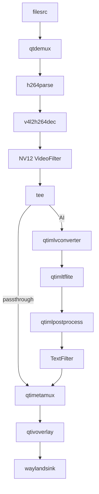

# Artifact Contract

## Output Files

For normal runnable Python app requests, generate exactly:

- `<artifact>/main.py`
- `<artifact>/README.md`

For YAML-mode requests using `Pipeline.from_yaml(...)`, also generate the YAML config file unless the user explicitly says the YAML is already provided externally and should not be generated. Use the requested YAML basename, for example:

- `<artifact>/configs/yolov8_camera_overlay.yaml`

Do not generate `CMakeLists.txt` for Python apps.

Artifact folder names must start with `qimsdk-python-`.

## README Requirements

Every artifact README must include:

- purpose
- files
- generated YAML config file, when `Pipeline.from_yaml(...)` is used
- assumptions
- `Pipeline Flow` with `Text Summary` and `Mermaid Diagram` subsections
- placeholders to fill
- `Steps to Run on QLI`
- custom preprocess TODOs, when generated
- custom postprocess TODOs, when generated

`Text Summary` and `Mermaid Diagram` must match actual code wiring.

If a `qticamsrc`/`qtiqmmfsrc` camera app defaults omitted camera caps to `1920x1080 @ 30fps`, README assumptions must call out that default explicitly.

## Runtime Setup for Steps to Run on QLI

Before writing README `Steps to Run on QLI`, inspect the actual generated `main.py` and determine which of these apply:

- If one or more stages explicitly selects the GPU delegate (`.set("delegate", "gpu")` on a discrete filter/inference stage, or `.set("inference-delegate", "gpu")` on an ML-bin stage — not for HTP/NPU external delegate selections), include `export OCL_ICD_FILENAMES=/usr/lib/libOpenCL_adreno.so.1`.
- If the app has a high-scale/concurrency topology (multiple independent, concurrently active input streams — multistream fan-out, an AI wall of separate source streams, or genuine multi-stream batched inference across multiple sources; not a single input stream even with multiple parallel AI branches, a daisy-chain, or a display grid), include `ulimit -n 10000`.
- If one or more sinks is `waylandsink` (including multiple instances), include Wayland socket discovery (`WS=$(find ...)`, `XDG_RUNTIME_DIR`, `WAYLAND_DISPLAY`).
- If `main.py` contains `pulsesrc` or `pulsesink`, include `wpctl status` followed by `wpctl set-default <node_no.>`. Replace `<node_no.>` with the actual device-specific node number discovered from `wpctl status`; no default node number can be assumed.
- If `main.py` uses `qticamsrc`/`qtiqmmfsrc`/`v4l2src` (camera), consumes an RTSP input, or reads from `filesrc`/another file-backed source, add a short prose note (not a shell export) immediately after the `python3 /root/main.py` run command stating the corresponding readiness requirement: camera/`cam-server` availability, an upstream RTSP producer already running, or the input file(s) existing at their referenced paths.

Join every applicable command from the four rows above into exactly ONE combined `&&`-chained bash command block immediately before the on-device `python3 /root/main.py` run command, in this order: PulseAudio node selection, GPU/OpenCL export, file-descriptor limit, then Wayland discovery/exports:

```bash
wpctl status && \
wpctl set-default <node_no.> && \
export OCL_ICD_FILENAMES=/usr/lib/libOpenCL_adreno.so.1 && \
ulimit -n 10000 && \
WS=$(find /run -maxdepth 3 -name "wayland-*" ! -name "*.lock" 2>/dev/null | head -1) && \
export XDG_RUNTIME_DIR=$(dirname "$WS") && \
export WAYLAND_DISPLAY=$(basename "$WS")
```

State that the block runs on the device (after `ssh root@<device-ip>`), immediately before the `python3 /root/main.py` line. Omit each line whose row is not applicable and omit the whole block if no command-based row applies. The `&&` chain must remain one fenced bash block even when only one command-based prerequisite applies.

## YAML Artifact Rules

When the app calls `Pipeline.from_yaml(...)`:

- Generate the YAML config file in the artifact unless the user explicitly says an external YAML is already supplied and should not be generated.
- If the user explicitly says the YAML file already exists or is provided externally, do not generate it; put the exact phrase `External YAML provided by user` in README assumptions.
- Preserve the user-provided YAML target path in `main.py` when supplied.
- If the generated YAML is stored under the artifact, include `Steps to Run on QLI` commands that also `scp` the YAML alongside `main.py`, then, on-device after `ssh root@<device-ip>`, create the target directory and copy the YAML to the target path before running `python3 /root/main.py`.
- If model, label, media, or settings paths are missing, put explicit placeholders in the YAML and list them in README.
- The YAML root must be `pipeline:`, with `elements:` and `links:` sections matching the SDK parser.
- Every `pipeline.elements` item must use `type:` and `name:`. For normal GStreamer elements, `type:` is the factory name, for example `type: qticamsrc`; do not emit a separate `factory:` key.
- Element properties must be flat keys on the element mapping, for example `camera: 0` or `model: /path/model.tflite`; do not nest them under `properties:`.
- Encode stream filters as `type: filter` with `video:`, `text:`, `tensor:`, `image:`, `h264:`, `audio:`, or `caps:` blocks.

## Pipeline Flow Rules

Every generated README must include:

- `## Pipeline Flow` with a concise text summary of the actual SDK element order and branch paths
- `### Text Summary` immediately before the text summary
- `### Mermaid Diagram` immediately before a fenced Mermaid diagram using a `mermaid` code fence
- `## Steps to Run on QLI` for runtime commands. As the first line, always state that all models, labels, media, and any other files the app references must already be present on the device at their referenced paths before running. Then show the exact device deployment sequence: `scp` the artifact to the device, then `ssh` in and run it with `python3`:

  ```bash
  # Copy the app to device
  scp main.py root@<device-ip>:/root/

  # SSH into device and run
  ssh root@<device-ip>
  python3 /root/main.py
  ```

  When a command-based prerequisite applies, insert the env-setup block between `ssh root@<device-ip>` and `python3 /root/main.py`, for example:

  ```bash
  # Copy the app to device
  scp main.py root@<device-ip>:/root/

  # SSH into device and run
  ssh root@<device-ip>
  WS=$(find /run -maxdepth 3 -name "wayland-*" ! -name "*.lock" 2>/dev/null | head -1) && \
  export XDG_RUNTIME_DIR=$(dirname "$WS") && \
  export WAYLAND_DISPLAY=$(basename "$WS")
  python3 /root/main.py
  ```

  Unlike compiled/script artifacts in the other builder skills (GStreamer, C++), Python apps do not need `chmod +x` — they are invoked via `python3 <path>`, not executed directly, so the executable bit is irrelevant; never add a `chmod +x` step here. Keep `<device-ip>` as an explicit unresolved placeholder; never invent a real IP. If YAML-mode also generates a config file, add it to the `scp` step (or a `configs/` subdirectory as generated) and add the on-device `mkdir -p`/copy-to-target-path step after `ssh`, before `python3 /root/main.py`.

Generate the flow from the actual `main.py`, not from a generic template.

Mermaid direction:

- use `flowchart LR` for simple linear pipelines
- use `flowchart TD` for branched, daisy-chain, multi-stream, or dual-pipeline apps

Mermaid formatting:

- node labels should use SDK element/plugin names present in `main.py`, such as `[filesrc]`, `[qtdemux]`, `[v4l2h264dec]`, `[qtimltflite]`, and `[waylandsink]`
- represent stream filters as their actual purpose, such as `[NV12 VideoFilter]` or `[TextFilter]`
- use unique node IDs
- put caps/filter constraints in separate nodes instead of packing punctuation-heavy text into edge labels
- use `subgraph` for AI stages, daisy-chain stages, multiple streams, or multiple independent pipelines
- label tee or split edges only when it improves clarity, for example `-->|AI|` or `-->|passthrough|`

Example:



## App Requirements

`main.py` must:

- import from public `qimsdk`
- define `create_and_execute_pipeline(...)`
- define `main() -> None`
- keep executable pipeline construction and `pipeline.execute()` inside `create_and_execute_pipeline(...)`
- keep logging setup, argument parsing, and the call to `create_and_execute_pipeline(...)` inside `main()`
- end with `if __name__ == "__main__": main()`
- use explicit construction by default
- preserve user-provided runtime values
- include useful comments for major sections and TODO placeholders
- call `pipeline.eos(True)` before `execute()` for file/mux outputs
- avoid manual SIGINT handling unless requested

## Verification Workflow

After generating or editing an artifact:

```bash
references/verify-python-app.sh <artifact-dir>
```

Then review contextually:

- Does the topology match the request?
- Are placeholders listed in README?
- Does README `Text Summary` and `Mermaid Diagram` match code?
- Is construction style explicit unless user requested implicit?
- Are custom preprocess placeholders honest and explicit about missing tensor conversion logic?
- Are custom postprocess placeholders honest and type-correct?
